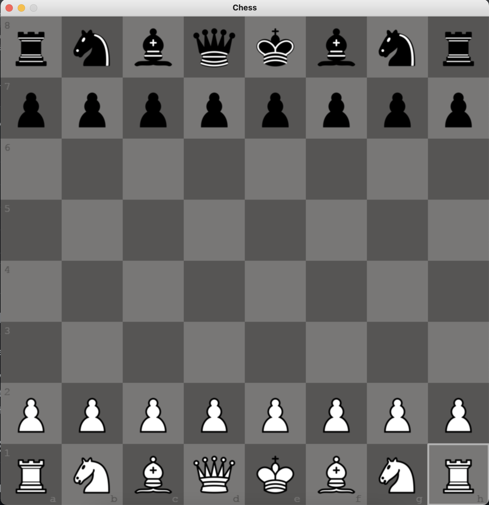

Задачі:

Розробка гри в шахи.
Реалізація графічного інтерфейсу для взаємодії з гравцями.
Логіка гри та обробка ходів.
 
Вибір бібліотеки:

Обрано бібліотеку mygame через її зручний інтерфейс та можливості для роботи з графікою у Python.
Аналізовано інші аналогічні бібліотеки, але mygame відповідала потребам проекту найкраще.
Встановлення та Настройка:

Встановлення бібліотеки виявилося простим і швидким.
Документація містила необхідну інформацію для швидкого старту.
Документація:

Документація була зрозумілою та докладною.
Надані приклади використання сприяли розумінню функціональності.
Використання:

Використання бібліотеки виявилося простим та логічним.
Доступні класи та методи відповідали вимогам гри в шахи.
Зручність використання:

Зручно використовувати, не вимагало багато надлишкового коду.
Бібліотека надала зручний інтерфейс для реалізації гри.
Поведінка елементів бібліотеки:

Поведінка класів та методів була передбачуваною та зрозумілою.
Взаємодія та Проблеми:

Взаємодія між різними класами була ефективною.
Проблеми з використанням не виникали.
Позитивні аспекти:

Зручний інтерфейс для графічного програмування.
Доступність документації та прикладів.
Негативні аспекти:

Рекомендації на майбутнє:

Залишити використання mygame для подібних проектів.
Розглянути можливості розширення гри та додавання нових функцій.
Цей звіт вказує на успішне та позитивне використання бібліотеки mygame для розробки гри в шахи. Немає серйозних проблем або негативних аспектів, і рекомендації спрямовані на подальше використання та розвиток проекту.

# Game Snapshots

## Snapshot 1 - Start (green)

## Snapshot 2 - Start (brown)

## Snapshot 3 - Start (blue)

## Snapshot 4 - Start (gray)

## Snapshot 5 - Valid Moves

## Snapshot 6 - Castling

Використані джерела

charGPT   
google  
youtube  
stackoverflow.com/ 
